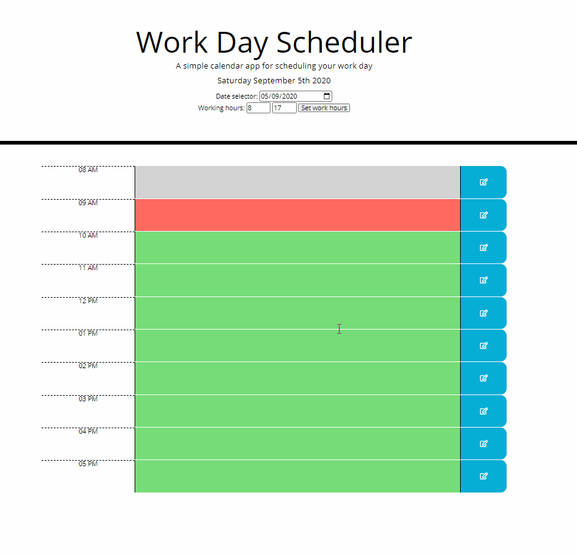

# Work Day Scheduler

* [Description](#Description)
* [Usage](#Usage)
* [Technologies Utilized](#Technologies-Utilized)
* [Work Day Scheduler Link](#Work-Day-Scheduler-Link)
* [Contact](#Contact)
* [License](#License)

## Description
A simple calendar application that allows the you to save events for each hour of the day. The app runs in the browser and features dynamically updated HTML and CSS powered by jQuery.

This app runs in the browser and featuring dynamically updated HTML and CSS powered by jQuery. It includes the use of localStorage to save the calendar.

## Usage
To run the test navigate to the home page: <a href="https://chrisjmckeown.github.io/Work_Day_Scheduler/" target="_blank">Work Day Scheduler</a>

Use the daily planner to create a schedule:
* Open the planner
* The current day is displayed at the top of the calendar
    * Use the datepicker to view past and future days
* View timeblocks for standard business hours
    * Set your own work hours
* Timeblocks are color coded to indicate whether it is in the past, present, or future
    * Past timeblocks cannot be edited, personal preference.
* Click into a timeblock to enter an event

 

## Technologies Utilized
Primary technologies:
* Moment.js
* jQuery
* Javascript
* Bootstrap 4.5.2
* HTML-5
* CSS-3

## Work Day Scheduler Link

* Please find Work Day Scheduler page here: <a href="https://chrisjmckeown.github.io/Work_Day_Scheduler/" target="_blank">Work Day Scheduler</a>

## Contact

* Please contact me at: chris.j.mckeown@hotmail.com

## License

* See license here: <a href="https://github.com/chrisjmckeown/Work_Day_Scheduler/blob/master/LICENSE" target="_blank">license agreement</a>